# AI抠图项目

>使用开源模型 [briaai/RMBG-1.4](https://huggingface.co/briaai/RMBG-1.4)实现图像抠图。
>
> 本项目主要是为了学习和实践AI技术、gui开发、前端学习、i18n国际化等技术

## 项目介绍

- 本地模型算法进行抠图，支持单张和批量抠图
- 支持单张抠图和批量抠图
- 支持拖拽和粘贴
- AI证件照抠图功能
- 支持图片格式转换、批量转换
- 语言支持中文和英文
- 支持暗色和亮色主题
- 项目开源，可供学习和参考

## 证件tips

> 制作证件照时，可以灵活使用缩小、放大功能和移动选框来调整人物位置和需要的部位。

## 打包后的运行文件

链接: <https://pan.baidu.com/s/1XM37FOKZkLwafbsl5Y9xvw?pwd=hukj> 提取码: hukj

## 常见问题

### 1.  windows系统下，如果出现无法启动客户端的情况，请尝试以下操作
  
>本项目使用pywebview开发，在windows系统下会查找edgechromium ，edgehtml， mshtml 的客户端引擎依次检索。如果本地电脑 edge 浏览器支持这些引擎，则客户端可以正常启动。否则，需要安装对应的 [EdgeWebView2Runtime](https://developer.microsoft.com/en-us/microsoft-edge/webview2/?form=MA13LH) 浏览器引擎。

### 2. 问题反馈交流qq群

> QQ群号：779191959

### 3. windows系统如果运行时提示STATUS_ILLEGAL_INSTRUCTION，页面崩溃

> 请尝试更新Microsoft Edge到最新版本

### 赞助支持

> 如果您觉得项目对您有帮助，欢迎赞助支持。

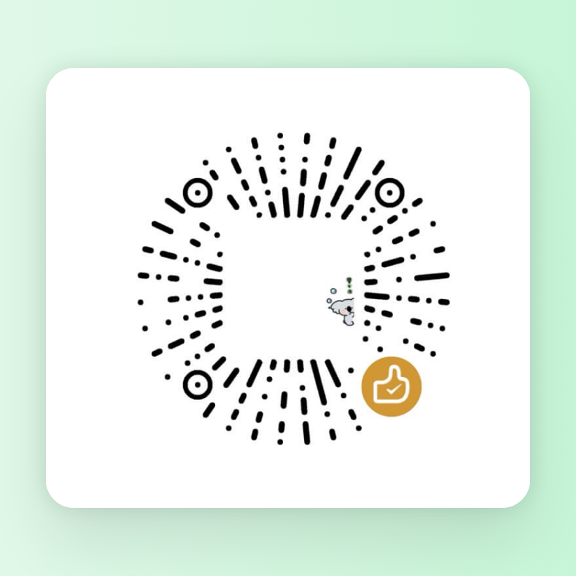

### 运行截图

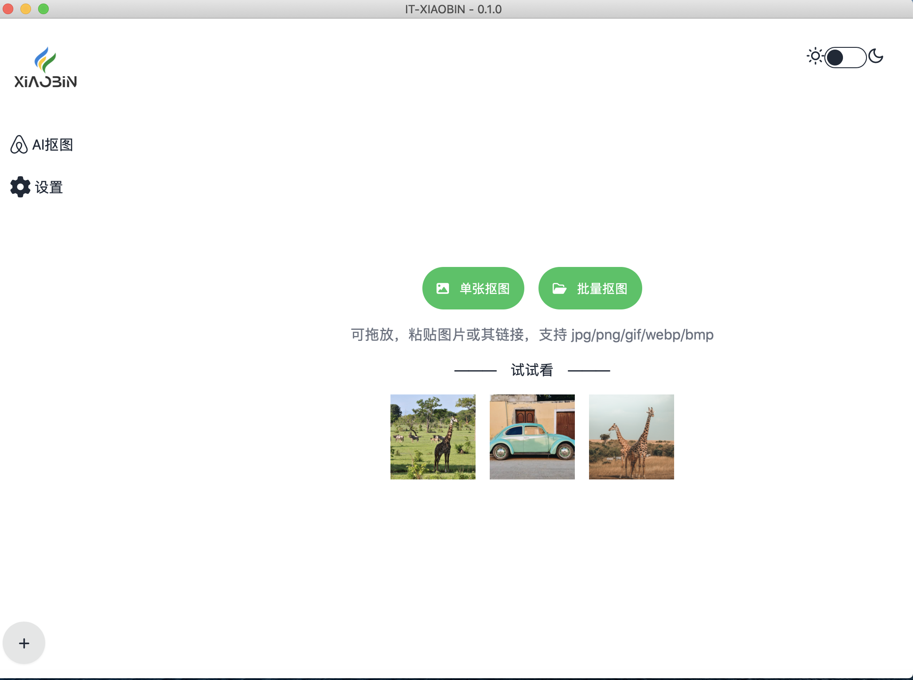
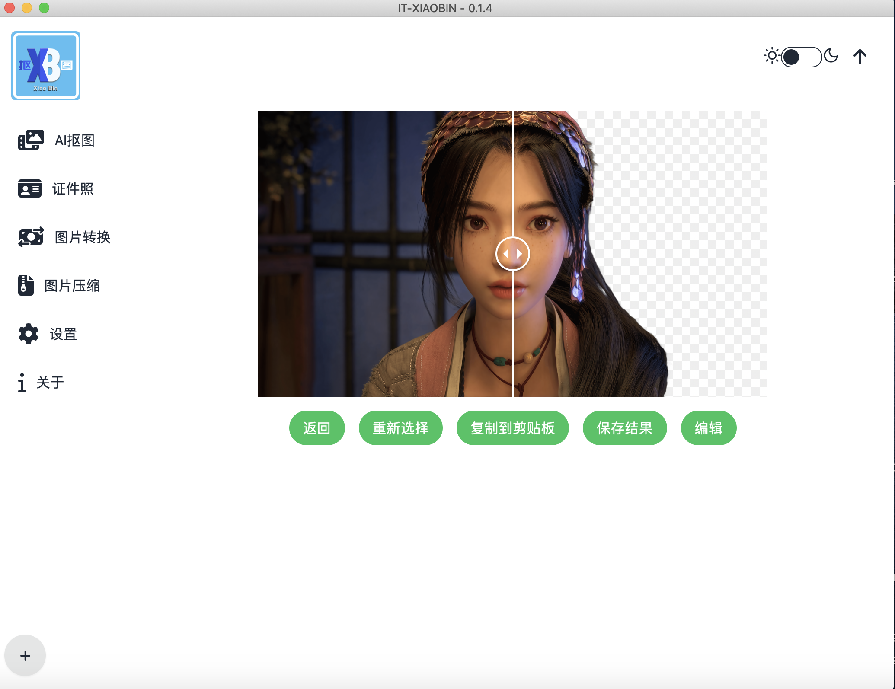
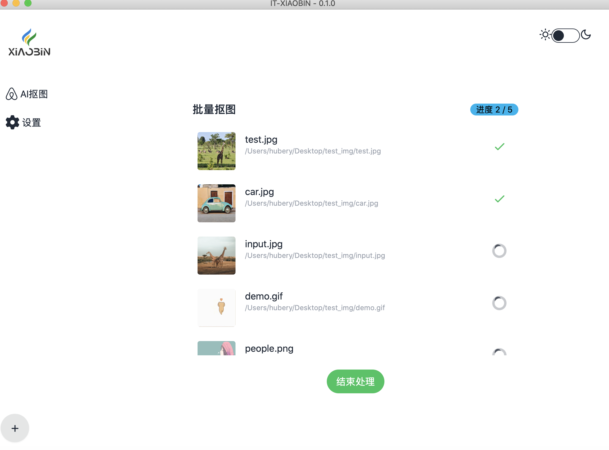
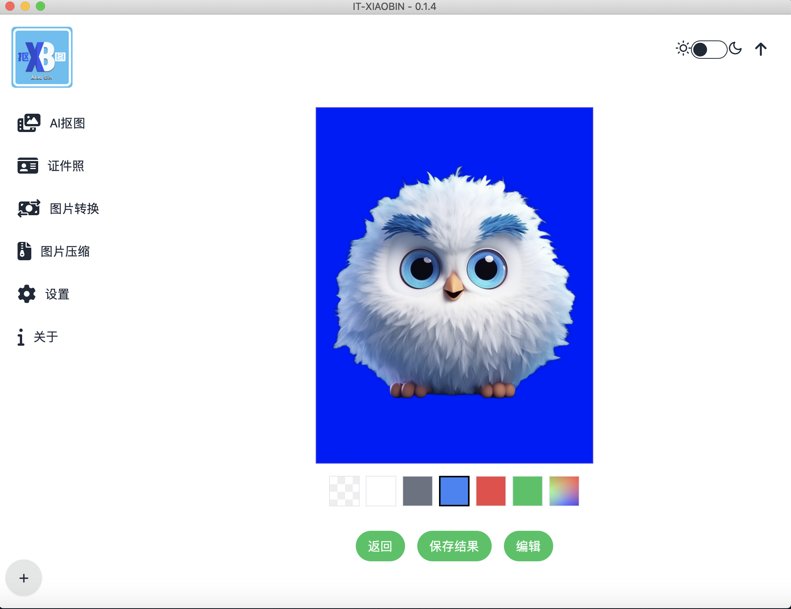
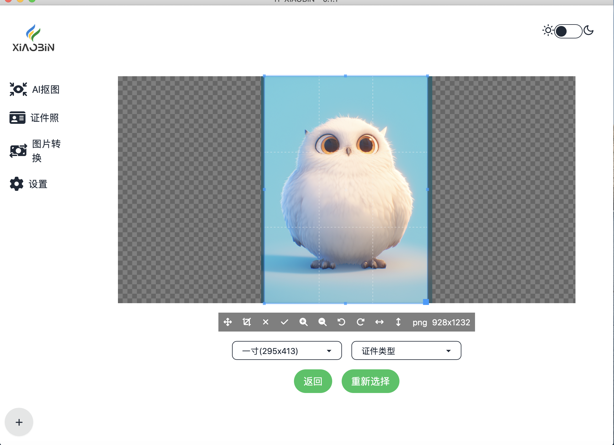
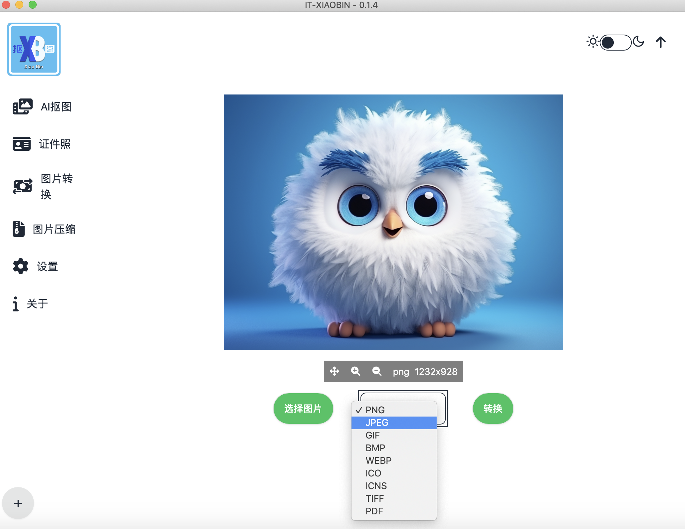
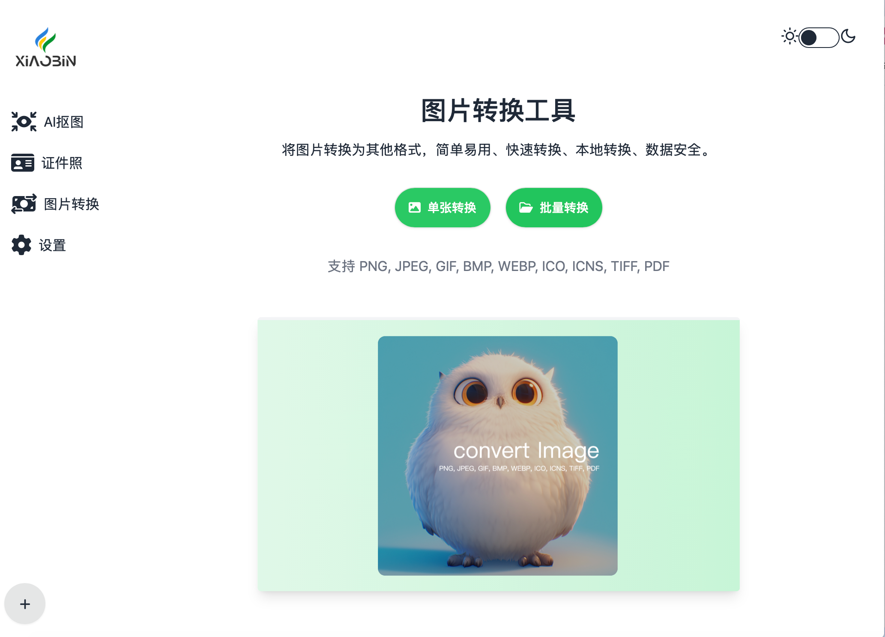
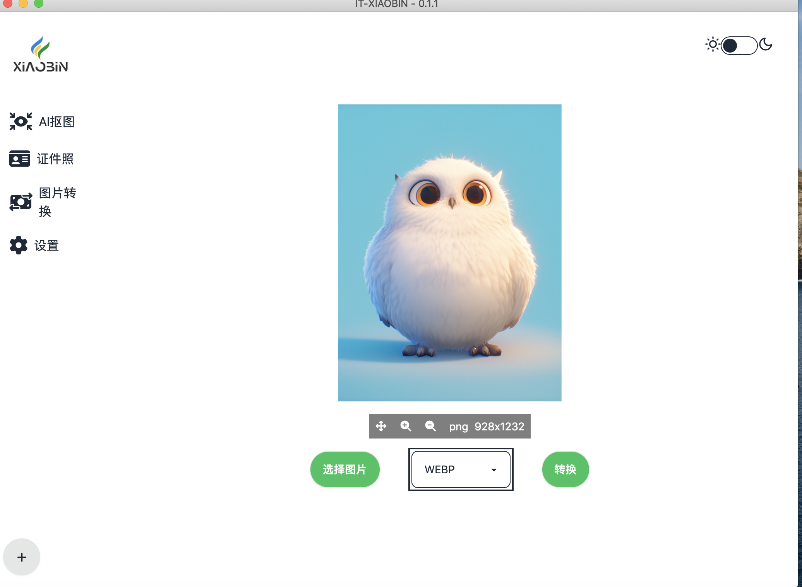
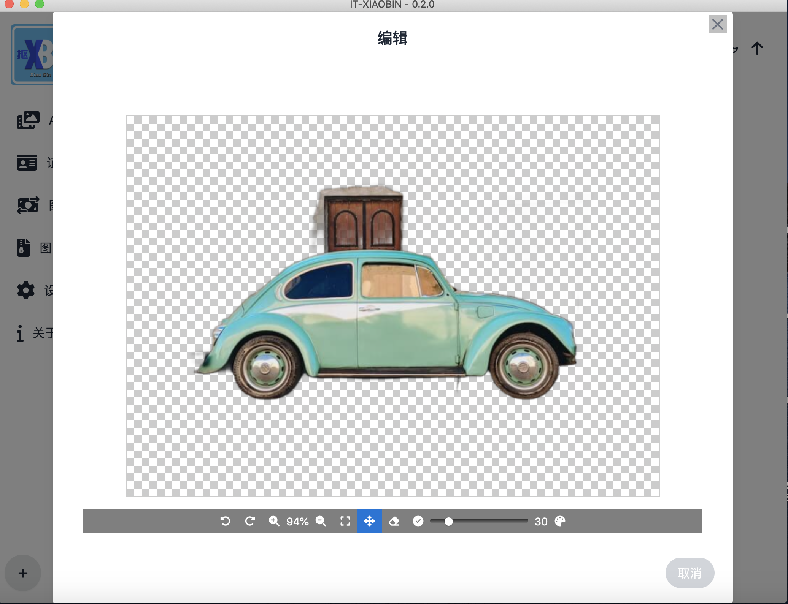
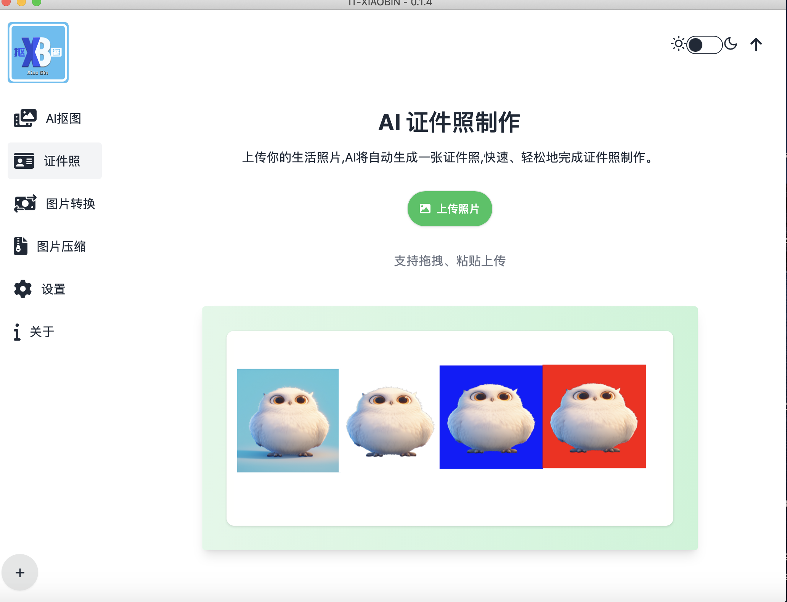
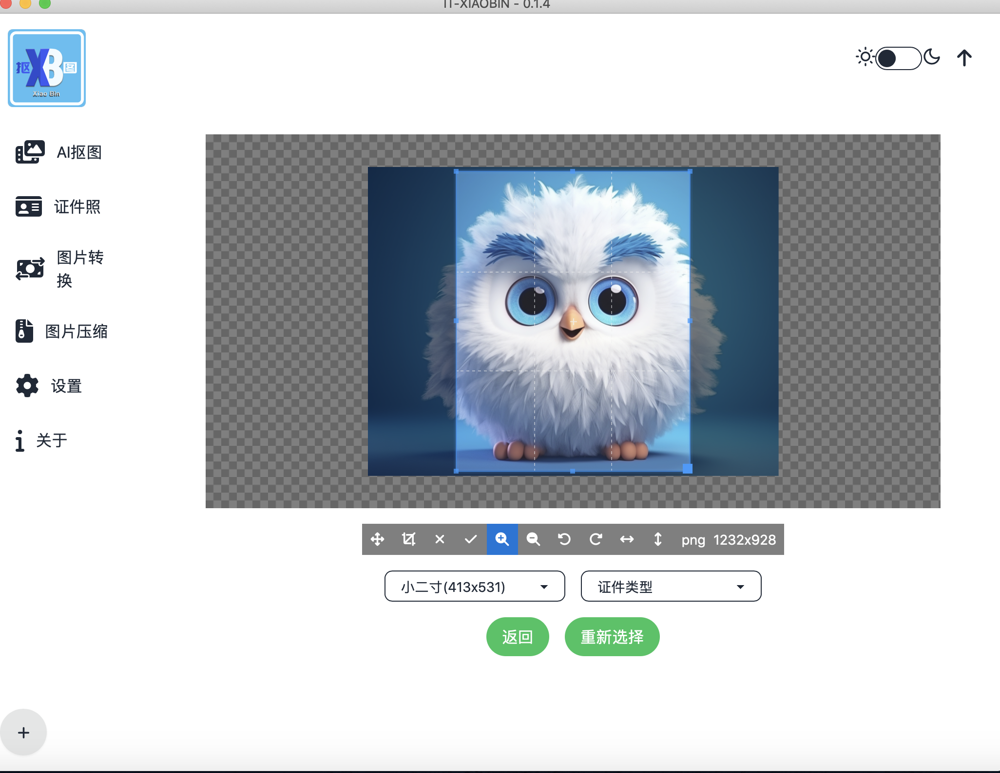

## Star History

