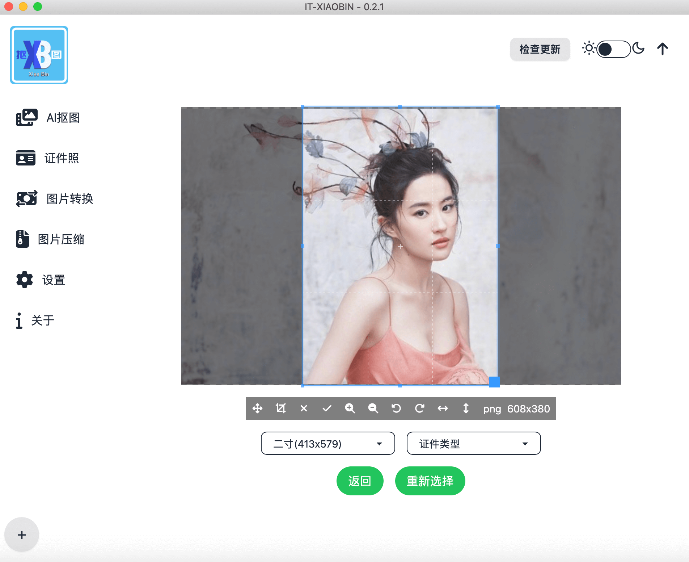
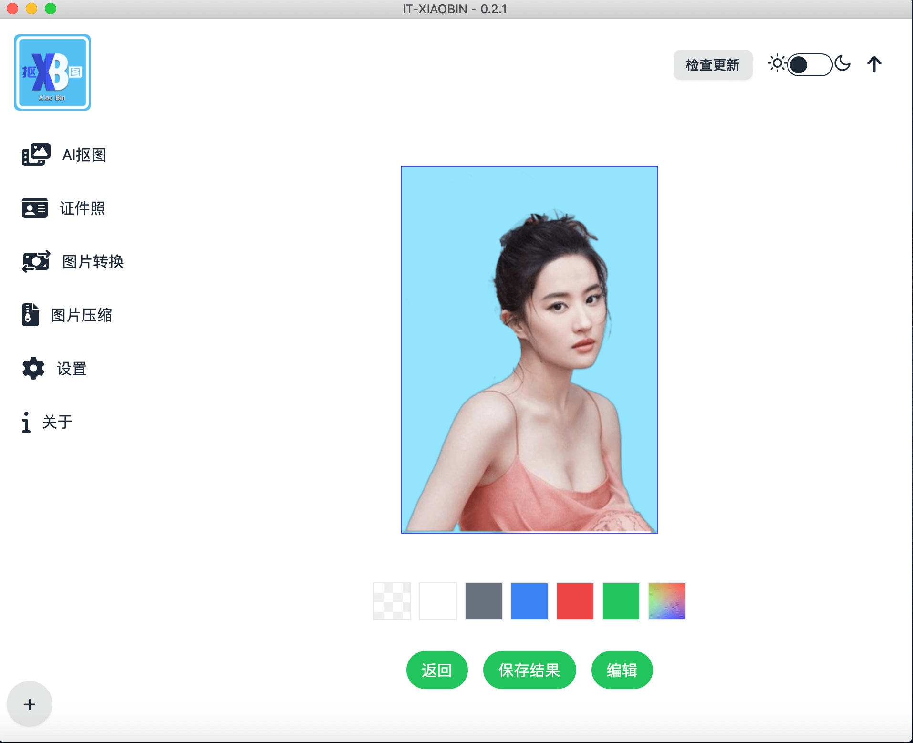
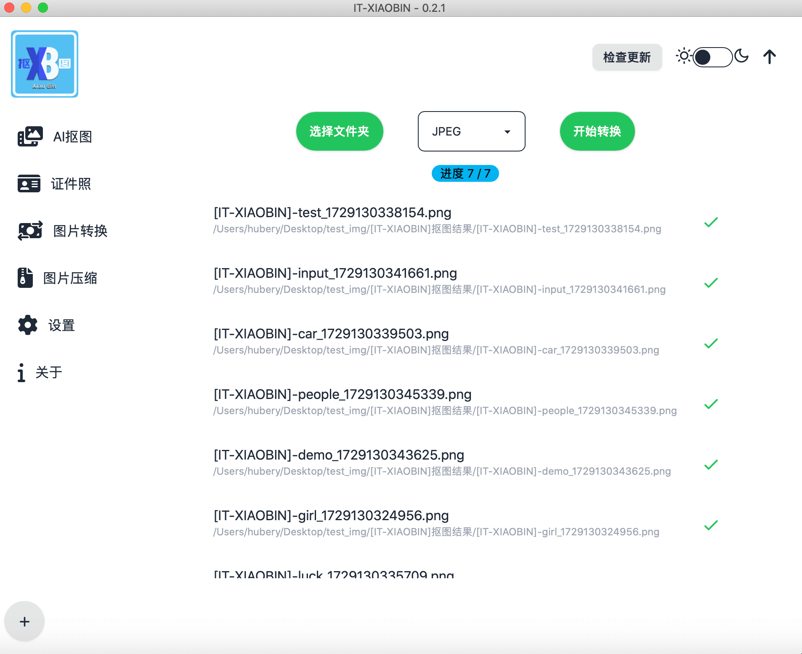
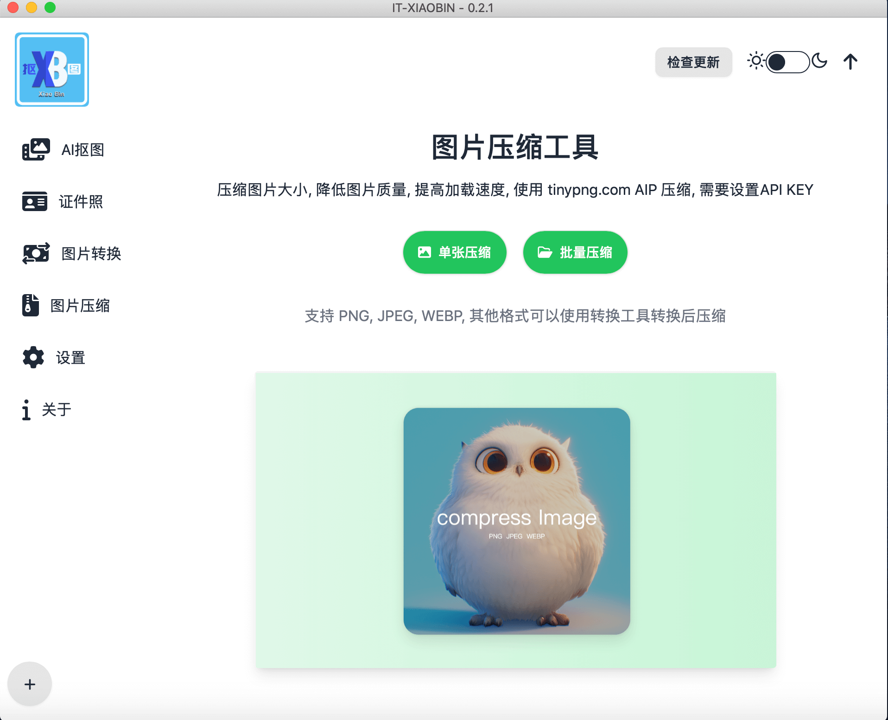
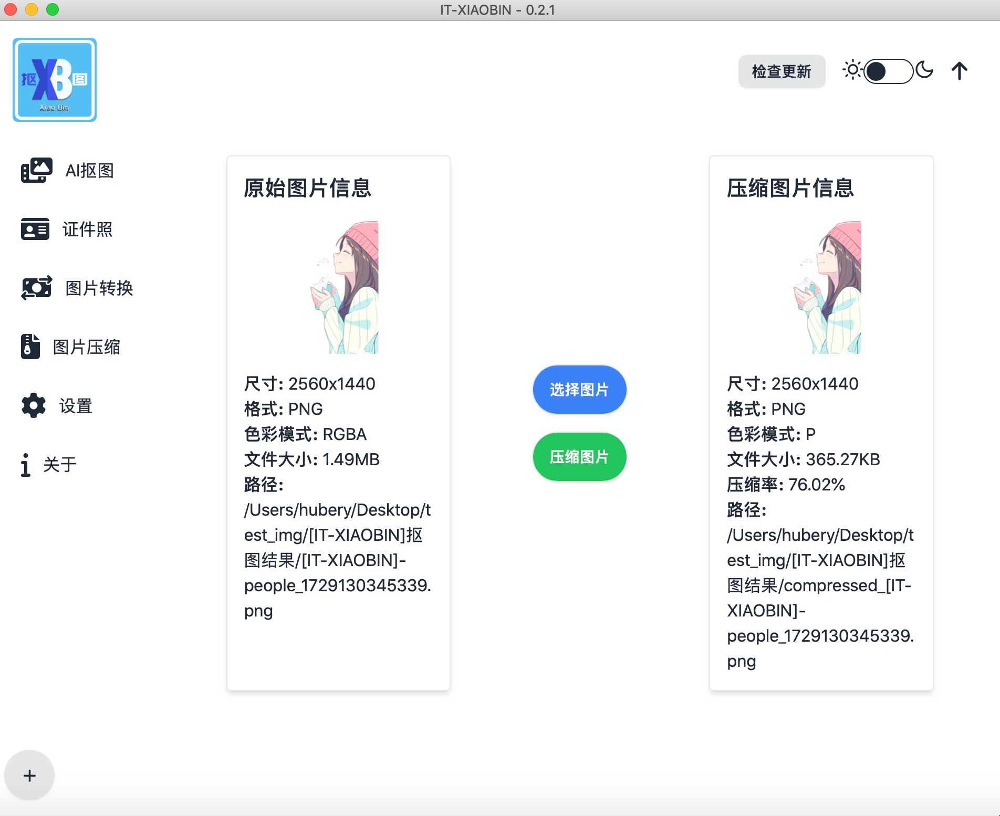
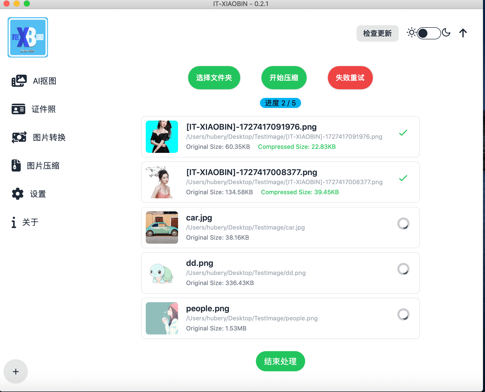

# AI抠图项目

>使用开源模型 [briaai/RMBG-1.4](https://huggingface.co/briaai/RMBG-1.4)实现图像抠图。
>
> 本项目主要是为了学习和实践AI技术、gui开发、前端学习、i18n国际化等技术

## 项目介绍

- 本地模型算法进行抠图，支持单张和批量抠图
- 支持单张抠图和批量抠图
- 支持二次编辑
- 支持拖拽和粘贴
- AI证件照抠图功能
- 支持图片格式转换、批量转换
- 支持图片压缩、批量压缩
- 语言支持中文和英文
- 支持暗色和亮色主题
- 项目开源，可供学习和参考

## TODO

- [x] 优化图片编辑功能，解决了放大缩小移动导致状态混乱的问题，**现在移动、放大、缩小、橡皮擦、撤销和回退等功能已正常运行**。
- [x] 增加AI抠图结果页的背景颜色切换功能
- [ ] ~~图片转换支持 AVIF 格式， 参考[issues/10](https://github.com/pangxiaobin/image-matting/issues/10)~~
- [x] 增加图片导出格式配置，支持psd、png、jpg等格式

## 证件tips

> 制作证件照时，可以灵活使用缩小、放大功能和移动选框来调整人物位置和需要的部位。

## 打包后的运行文件

- 百度网盘: <https://pan.baidu.com/s/1XM37FOKZkLwafbsl5Y9xvw?pwd=hukj>
- 夸克网盘: <https://pan.quark.cn/s/6b9ac495349c>
- UC网盘： <https://drive.uc.cn/s/7bbd0011e9f24?public=1>

## 常见问题

### 1.  windows系统下，如果出现无法启动客户端的情况，请尝试以下操作
  
>本项目使用pywebview开发，在windows系统下会查找edgechromium ，edgehtml， mshtml 的客户端引擎依次检索。如果本地电脑 edge 浏览器支持这些引擎，则客户端可以正常启动。否则，需要安装对应的 [EdgeWebView2Runtime](https://developer.microsoft.com/en-us/microsoft-edge/webview2/?form=MA13LH) 浏览器引擎。

### 2. 问题反馈交流qq群

> QQ群号：779191959

### 3. windows系统如果运行时提示STATUS_ILLEGAL_INSTRUCTION，页面崩溃

> 请尝试更新Microsoft Edge到最新版本

### 赞助支持

> 如果您觉得项目对您有帮助，欢迎赞助支持。

[捐赠列表](https://github.com/pangxiaobin/image-matting/wiki/Sponsor-Page)

### 鸣谢

感谢[nzls1795724370](https://github.com/nzls1795724370) 提供的图标设计

### 安装打包

[文档](./backend/README.md)

### 历史版本记录

#### v0.2.1

- 优化图片编辑功能，现在移动、放大、缩小、橡皮擦、撤销和回退等功能丝滑运行

#### v0.2.0

- 更改模型加载方式，打包体积缩小一倍
- 修复编辑图像后会存在图像分辨率降低的bug
- 新增版本检查按钮，方便及时获取最新版本
  
📢: 注意

- 开发模式，目前使用python版本为3.11.9，开发模式需要把之前的环境删除，安装3.11.9版本的python环境。
- 把之前的backend/hub_model下的briaai 文件删除，执行 pdm run python hub_model/download.py 下载新模型。

#### v0.1.6

- 增加AI抠图结果页的背景颜色切换功能
- 增加图片导出格式配置，支持psd、png、jpg等格式
- 新增导出格式配置项

#### v0.1.5

- 更新图标样式
- 新增抠图结果编辑界面，支持橡皮擦功能

#### v0.1.4

- 新增图片压缩和批量压缩
- 优化windows 界面展示
- 新增about页面
- 新增tinypng key 设置页面
- 更新前端依赖，修复vue router not support params

#### v0.1.3

- 新增图片格式批量转换
- 新增窗口置顶
- 修复win图标不展示问题

#### v0.1.2

- 新增图片格式转换
- 增加图片展示组件

#### v0.1.1

- 新增证件照抠图功能；
- 解决windows 打开文件异常；
- 已更新win 打包确少模型依赖文件；

#### v0.1.0

- 项目初始化版本,基础AI抠图功能

### 操作演示视频

[bilibili](https://www.bilibili.com/video/BV1PksZeoEQR/)

<iframe
    height=450
    width=800
    src='https://www.bilibili.com/video/BV1PksZeoEQR/'
    frameborder=0
    'allowfullscreen' >
</iframe>

### 运行截图

## Star History

