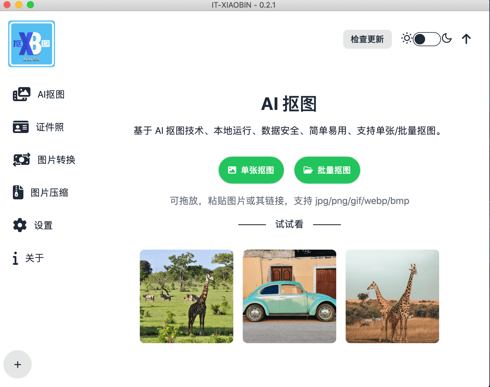
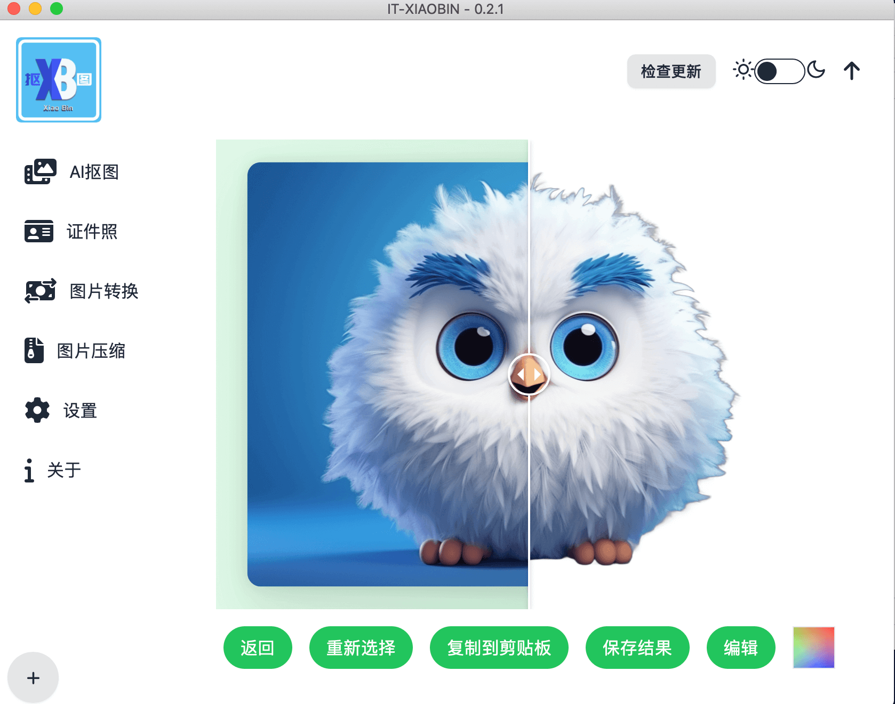
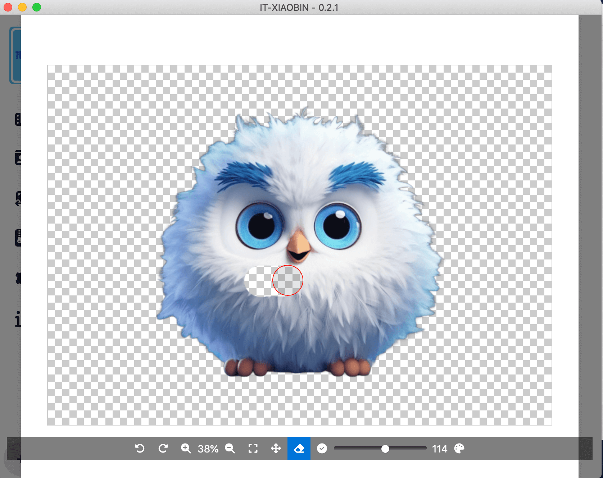
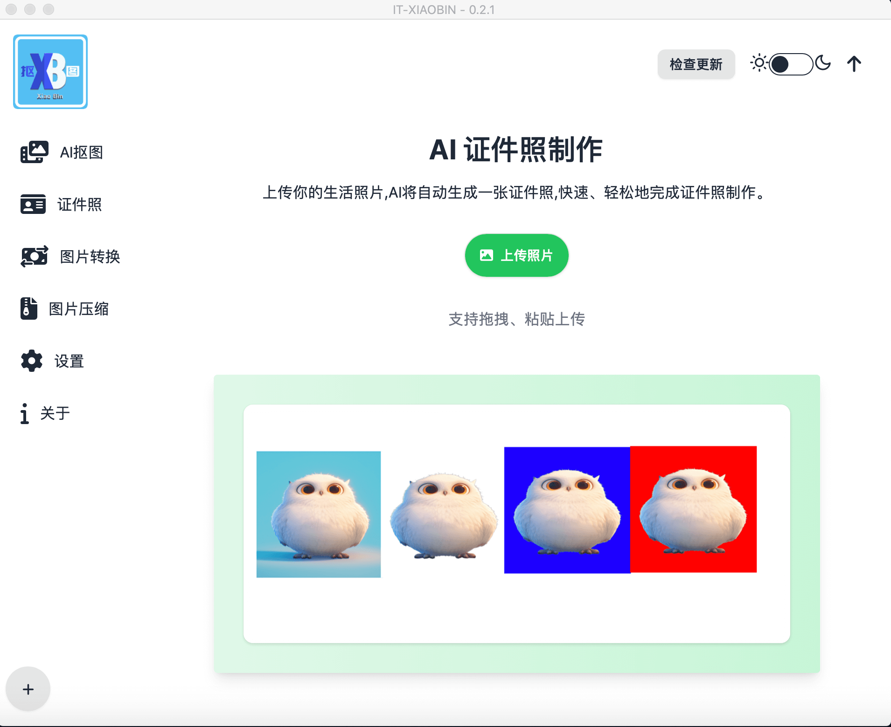

# AI抠图项目

>使用开源模型 [briaai/RMBG-1.4](https://huggingface.co/briaai/RMBG-1.4)实现图像抠图。
>
> 本项目主要是为了学习和实践AI技术、gui开发、前端学习、i18n国际化等技术

## 项目介绍

> 本地模型算法进行抠图，支持单张和批量抠图
> 支持单张抠图和批量抠图
> 支持拖拽和粘贴
> AI证件照抠图功能

## 打包后的运行文件

链接: <https://pan.baidu.com/s/1XM37FOKZkLwafbsl5Y9xvw?pwd=hukj> 提取码: hukj

### 运行截图

